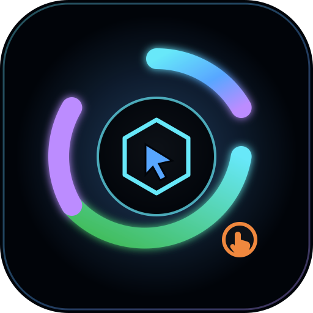

# Orderzx



**A live, stealth-capable, autonomous Chrome inside your DeepSeek Harness conversation** — the `dsh-browser` plugin.

[](https://github.com/canelaslorenzoenego-ai/Orderzx/actions)
[](#verified-end-to-end)
[](https://github.com/canelaslorenzoenego-ai/Orderzx/releases)
[](#license)

The agent drives a real browser with humanized input. You watch every click,
scroll and keystroke live in a docked dashboard — and you can grab the mouse
anytime. CAPTCHAs pause the agent and hand the widget to **you**, in-session,
with your own fingerprint and IP: the one solve that always works.

**Zero cloud. Zero accounts.** Everything runs on `127.0.0.1`.

**Ready to install — one command:**

```bash
curl -fsSL https://github.com/canelaslorenzoenego-ai/Orderzx/releases/download/v0.2.0-rc.9/install.sh | bash
```

It clones to `~/.orderzx/dsh-browser`, installs, builds, and prints the exact
line to add `dsh-browser` to your harness plugin list. Details: [Install](#install).


```
you:  "book me a table at X"
   chatbar   🖥 ▸ starting browser…            ← capsule monitor animation
   dashboard extends ────────────────────────────────────────┐
   │ Home │ shopper │ researcher      [screenshot ▾] [×]     │ ← tab per sub-agent
   │  ◀ ▶ ⟳  https://restaurant.example                      │
   │     live frames + the agent's ghost cursor clicking      │
   │  ▸ timeline (every action, newest first)                 │
   │  [ Take over ]   1366×768 · humanized                    │ ← your mouse, on request
   └──────────────────────────────────────────────────────────┘
```

---

## See it think

- **Live stream you can grab** — on-demand screenshots by default, CDP
  screencast by flag, DOM fallback when capture is blocked. Takeover swaps the
  ghost cursor for an amber "you" hand; gestures stay actor-tagged forever.
- **Gesture captions** — a chip on the stream narrates intent in words:
  `click "Sign in"`, `scroll down 480px`, `you · type 12 chars`.
- **Ask for the video, get the video** — `browser_clip` samples real frames and
  delivers them to the session *and* hands the model a `chatLine` it pastes
  verbatim into chat. Replays draw the model's hand back over the frames.
- **`browser_reel`** — one call → one standalone HTML artifact: frames +
  gesture track + scrubber, zero dependencies, signed URL, sandbox CSP.
- **Video-aware boost** — a playing `<video>` tightens the stream to ~3 fps so
  motion reads as motion; `browser_transcript` reads what a video *says*.

## What it does

- **27 tools** — observe/act/type/press/scroll/navigate/tabs/extract, forms,
  evaluations behind a policy gate, workflows (record a human demo → replay),
  background jobs with live progress, cookies (metadata only), fenced files.
- **Stealth that reports honestly** — Patchright by default (suppressed CDP
  tells), CloakBrowser fork optional, humanized input, per-session fingerprints.
  The posture endpoint says what the engine *actually* does.
- **CAPTCHA = handoff, not solving** — challenge detected → agent pauses →
  widget renders in your session → you solve → agent resumes with context.
- **Self-heal** — refs killed by a reload re-resolve from element identity;
  coordinates are the last resort, never the first.
- **Workflows & jobs** — record your mouse, replay it humanized; password-shaped
  fields become required `{{variables}}`, so secrets never touch disk.

## Android phone

`dsh-android` ships the same dashboard over ADB/WireGuard: the phone renders
frames and gestures from your desktop session. Watch-only by design.

## Compatibility contract

Built to survive any dsh-web / Cordis generation, past or future:

- **Structural, not nominal** — type-checks against both `cordis` and
  `@deepseek-ai/cordis`; optional services (approval, vision) are feature-detected
  via `ctx.inject([...])`, never required.
- **Additive-only wire changes** — fields appear, never disappear or retype.
  Readers ignore unknown fields, so old payloads always parse in new builds.
- **Versioned protocol** — `status.compat` carries `{protocol, plugin, guarantees}`.
  A newer harness degrades the panel to a visible banner, never a blank screen.
- **Three surfaces only** — `mountRoutes`, `ctx.effect` tool registration and the
  signed-route fence: the contract the harness has never had to change.
- **Node ≥ 20**, no native deps, no pinned harness version.

Enforced by smoke steps that feed the suites yesterday's manifests, tomorrow's
unknown fields and mismatched protocol numbers.

## Verified end-to-end

**610 checks, all runnable from this checkout:**

| suite | checks | proves |
|---|---|---|
| tools | 200 | every tool against an emulated engine, refusals, scoring |
| routes | 77 | fence-before-capability, token scopes, capture containment, compat |
| frames | 72 | transports, tiers, suppression, boost cadence |
| panel | 202 | the real client bundle SSR'd: capsule, overlay, drawers, players |
| mcp | 13 | the bridge over a real spawned child's stdio |
| live | 31 | real Chromium over CDP: start → stream → click → heal → clips → reels |
| e2e | 15 | real host + real routes + real bundle, end to end |
| mount | 5 | the REAL harness path: cordis loader + include + cordis.yml entry mounts us, tools land in ToolRuntime, dispose unregisters |

```bash
pnpm test            # 564 static assertions, no browser needed
pnpm run test:live   # 31 against a real Chrome (opt-in)
pnpm run test:e2e    # 15: host + routes + client bundle + Chrome
node scripts/dev-host-mount-smoke.mjs  # 5: real cordis loader mount
```

## Install

```bash
curl -fsSL https://github.com/canelaslorenzoenego-ai/Orderzx/releases/download/v0.2.0-rc.9/install.sh | bash
```

Prefer source? Clone and `pnpm install && pnpm run build`, then wire the built
entry into your harness. The script above does exactly this into
`~/.orderzx/dsh-browser` and prints the exact YAML for you.
Release assets: `install.sh` + a sample replay reel.

**Wire it in** — the harness loader (`@deepseek-ai/cordis-plugin-loader` +
`cordis-plugin-include`) reads `cordis.yml` as a **bare list of entries**; each
entry imports its `name` as a module specifier. Point `name` at the built file:

```yaml
- id: dsh-browser
  name: file:///home/you/.orderzx/dsh-browser/lib/index.js
  config:
    engine:
      provider: patchright
```

Not `plugins: [- path: …]` — the loader has no `path` key and no wrapper; a
wrong-shaped entry silently never mounts. Config keys: [Configuration](#configuration).

## Configuration

Everything is YAML with defaults; nothing security-relevant is a tool argument.

| key | default | meaning |
|---|---|---|
| `engine.provider` | `patchright` | `patchright` · `cloakbrowser` · `cdp` (attach your own) |
| `engine.humanize` | `true` | bezier pointers, jittered keys, honest posture |
| `frames.source` | `screenshot` | `screenshot` · `screencast` · `dom` |
| `frames.maxFps` | `5` | capture cadence = detection surface; boost tightens only for playing video |
| `policy.approvalForSensitiveActions` | `true` | harness approval prompts for sensitive verbs |
| `policy.allowEvaluate` | `false` | arbitrary page JS is a config gate, not a model right |

## Security posture

- Loopback-only routes, origin-fenced, capability tokens with TTLs and scopes.
- Captures and reels are `0o600`; cookie **values** never leave the browser;
  typed text never reaches the timeline; reels serve behind `default-src 'none'`.
- Takeover is monotonic-guarded; tools refuse with `pointer-owned` while you drive.
- No telemetry, no phone-home, no accounts — audit the whole surface in `src/routes.ts`.

## Demo & development

```bash
pnpm run demo          # standalone HTML dashboard, no Chrome required
pnpm run build         # server + client + standalone artifact
pnpm test              # static suites
```

Smoke suites import the compiled `lib/` — build first. Live suites need a
`--remote-debugging-port=9222` Chrome or use the bundled fixture.

## Credits & license

Patterns borrowed with gratitude from `dsh-android`, browser-use, Stagehand and
Patchright research. MIT — see [LICENSE](LICENSE).

## Dual use — read this

Autonomous browsing can violate site terms and local law. This plugin defaults
to handoff-over-solving, metadata-over-values and honesty-over-stealth for a
reason: run it on systems you own, against sites that allow automation.
